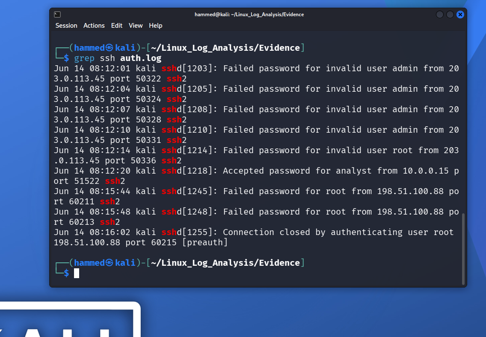
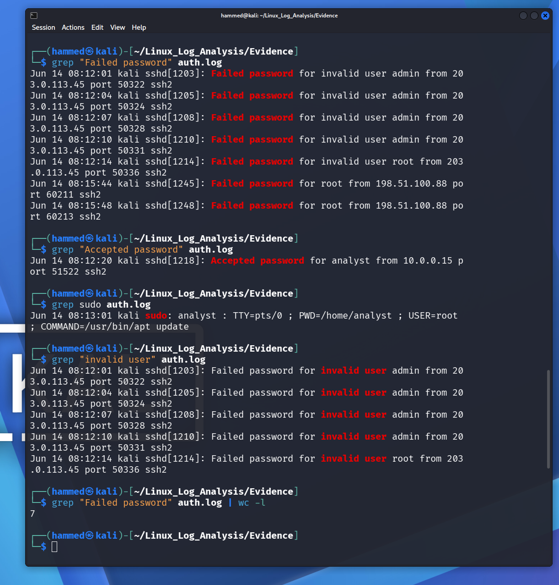
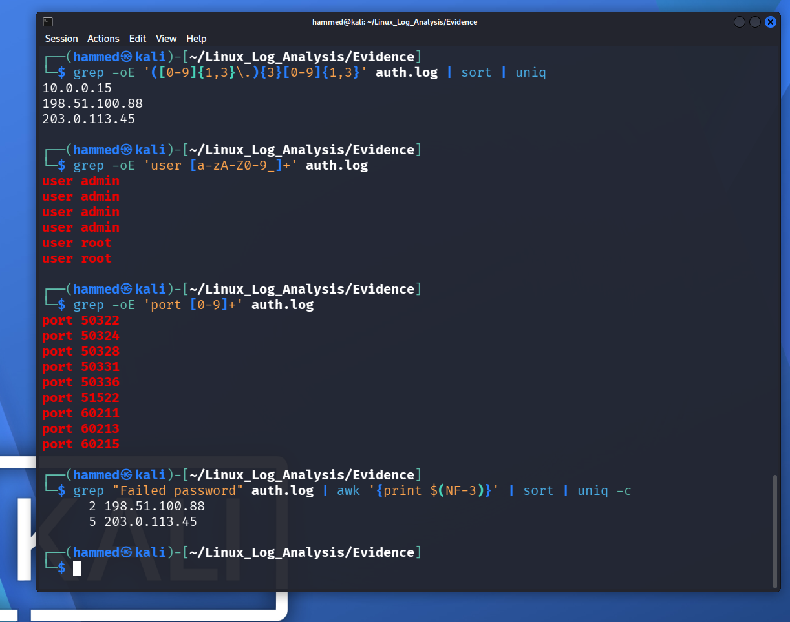
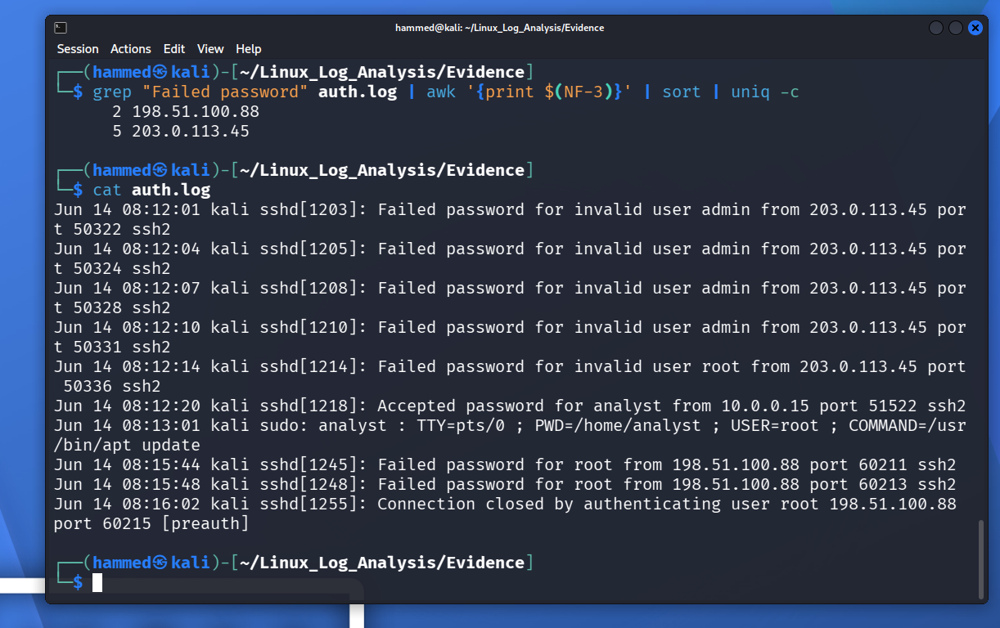

# Linux Log Analysis

## Overview

This project demonstrates a Blue Team investigation of Linux authentication logs to identify unauthorized SSH login attempts and validate legitimate user activity.

The investigation focuses on analyzing `auth.log` using common Linux command-line tools to detect brute-force attacks, identify Indicators of Compromise (IOCs), and document findings in a professional SOC-style incident report.

---

## Scenario

A Linux server generated multiple SSH authentication events. The objective of this investigation was to determine whether the observed activity represented a successful compromise or an unsuccessful brute-force attack by analyzing authentication logs and administrative activity.

---

## Objectives

- Analyze Linux authentication logs
- Identify failed SSH login attempts
- Identify successful logins
- Investigate sudo activity
- Extract Indicators of Compromise (IOCs)
- Map findings to the MITRE ATT&CK framework
- Produce a professional incident report

---

## Tools Used

- Kali Linux
- Linux Terminal
- grep
- awk
- sort
- uniq
- wc

---

## Skills Demonstrated

- Linux Log Analysis
- SSH Authentication Analysis
- IOC Extraction
- Threat Investigation
- Incident Documentation
- Command-Line Log Parsing
- MITRE ATT&CK Mapping

---

## Repository Structure

```
Linux_Log_Analysis/
│
├── Evidence/
│   └── auth.log
│
├── Screenshots/
│
├── README.md
├── Incident-Report.md
├── IOC-List.md
└── LICENSE
```

---

## Investigation Summary

The authentication logs revealed multiple failed SSH login attempts targeting administrative accounts from external IP addresses.

One successful login was identified from an authorized internal user followed by legitimate administrative activity.

No evidence of successful unauthorized access or system compromise was identified.

---

## MITRE ATT&CK

| Technique | ID |
|-----------|----|
| Brute Force | T1110 |
| Valid Accounts | T1078 |

---

## Screenshots

### SSH Authentication Events



### Authentication Analysis



### IOC Extraction



### Attack Timeline



---


## Author

**Hammed Gado**

Aspiring SOC Analyst | Blue Team | Network Security | Incident Response

---